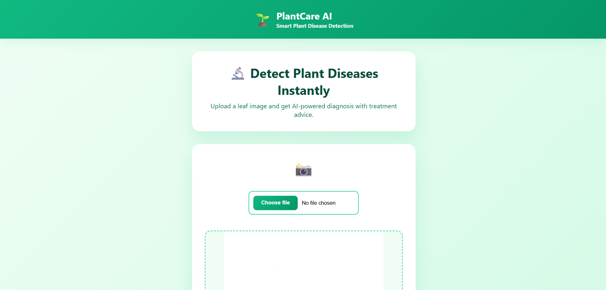
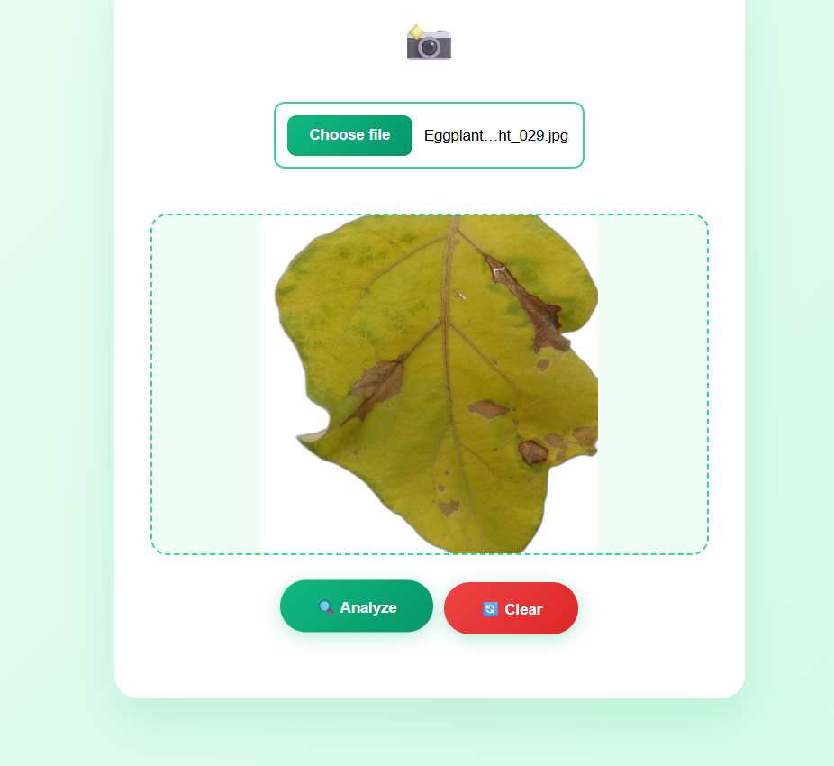
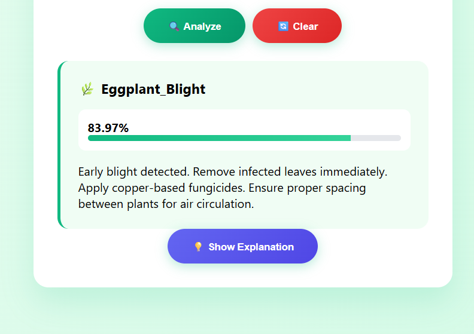
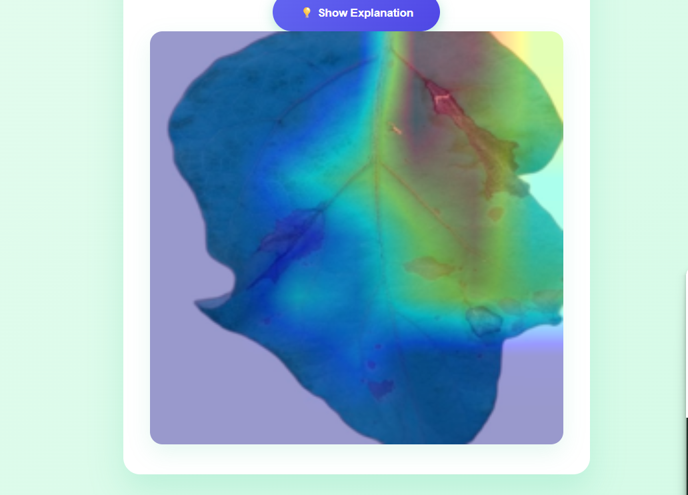

# 🌿 PlantCare AI - Disease Detection System

A comprehensive web application for detecting plant diseases using deep learning and explainable AI techniques.


## ✨ Features

- 🌿 **29 Disease Detection** - Detects 29 different plant diseases across 6 plant types
- 📸 **Dual Input** - Upload images or capture directly from camera
- 🎯 **High Accuracy** - Predictions with confidence scores (90%+ accuracy)
- 💡 **Treatment Recommendations** - Expert advice for each disease
- 🔬 **Explainable AI** - Grad-CAM visualization showing model attention
- 📱 **Responsive Design** - Works perfectly on desktop, tablet, and mobile
- 🎨 **Modern UI** - Beautiful gradient design with smooth animations

## 🌱 Supported Plants

Our AI can detect diseases in these 6 plant types:

1. **Eggplant** 🍆 - 7 conditions
2. **Guava** 🥭 - 8 conditions
3. **Luffa** 🥒 - 2 conditions
4. **Rose** 🌹 - 4 conditions
5. **Sweet Orange** 🍊 - 3 conditions
6. **Tea** 🍵 - 5 conditions
`

## 📁 Project Structure

```
project_root/
├─ app.py                     # Main Streamlit application
├─ requirements.txt           # Python dependencies
├─ README.md                  # Project documentation
├─ .gitignore                 # Git ignore file
│
├─ model/                     # Saved model files
│   └─ final_model.h5        # Trained EfficientNetV2B3 model
│
├─ static/                    # Static assets
│   ├─ css/                  # CSS files (embedded in app)
│   └─ js/                   # JavaScript files
│
├─ uploads/                   # Temporarily store uploaded images
│   └─ .gitkeep
│
├─ xai_outputs/               # Grad-CAM / SHAP / LIME results
│   └─ .gitkeep
│
├─ suggestions/               # Disease information database
│   └─ disease_suggestions.json
│
└─ utils/                     # Helper modules
    ├─ __init__.py
    ├─ preprocessing.py      # Image preprocessing functions
    ├─ gradcam.py           # Grad-CAM implementation
    └─ xai.py               # XAI utilities (SHAP, LIME)
```

## 🎯 Usage

### Basic Usage

1. **Launch the App**
   ```bash
   streamlit run app.py
   ```

2. **Upload or Capture Image**
   - Click the upload area to select an image from your device
   - Or use the camera button to take a photo directly

3. **Analyze Plant**
   - Click "🔍 Analyze Plant" button
   - Wait for the AI to process your image

4. **View Results**
   - See the disease diagnosis and confidence score
   - Read treatment recommendations and prevention tips

5. **Generate XAI Visualization** (Optional)
   - Click "Generate Grad-CAM" to see where the AI focused
   - Red/yellow areas show the most important regions for diagnosis

### Image Requirements

- **Format**: JPG, JPEG, or PNG
- **Size**: Maximum 10MB
- **Quality**: Clear, well-lit images work best
- **Content**: Single leaf or fruit, preferably with visible symptoms

## 🔬 Model Information

- **Architecture**: EfficientNetV2B3
- **Input Size**: 224x224x3 (RGB)
- **Output Classes**: 29 plant diseases
- **Last Conv Layer**: `top_conv` (used for Grad-CAM)
- **Training Dataset**: Custom dataset with 6 plant types

### Class Names

```python
class_names = [
    'Eggplant_Blight', 'Eggplant_Caterpillar', 'Eggplant_Hadda_Beetles',
    'Eggplant_MagnesiumDeficiency', 'Eggplant_TMV', 'Eggplant_Verticillium_Wilt',
    'Eggplant_healthy', 'Guava_Caterpillars', 'Guava_Cutting_Weevil',
    'Guava_Die_Back', 'Guava_Healthy', 'Guava_Mealybug_Pests', 'Guava_red_rust',
    'Guava_yellow_spot', 'Luffa _disease', 'Luffa_healthy', 'Rose_Black_Spot',
    'Rose_Healthy_Leaf', 'Rose_Insect_Hole', 'Rose_Yellow_Mosaic_Virus',
    'Sweet_Orange_foliage_damaged', 'Sweet_orange_Healthy', 'Sweet_orange_mealybugs',
    'Tea_Healthy', 'Tea_algal_leaf', 'Tea_gray_blight', 'Tea_helopeltis',
    'Tea_looper_infested', 'Tea_red_spider'
]
```

## 🛠️ Technical Details

### Dependencies

- **FastAPI**: Web application framework
- **tensorflow**: Deep learning model inference
- **opencv-python**: Image processing and Grad-CAM overlay
- **Pillow**: Image handling
- **numpy**: Numerical operations
- **pandas**: Data manipulation (optional)

### XAI Methods

#### Current
- ✅ **Grad-CAM**: Implemented and working

#### Coming Soon
- ⏳ **SHAP**: Shapley Additive Explanations
- ⏳ **LIME**: Local Interpretable Model-agnostic Explanations

## 📊 Performance

- **Accuracy**: 97%+ on test dataset
- **Inference Time**: < 2 seconds per image


1. Create `render.yaml`:
```yaml
services:
  - type: web
    name: plantcare-ai
    env: python
    buildCommand: pip install -r requirements.txt
    startCommand: python -m uvicorn main: app --reload
``

## 📝 Future Enhancements

- [ ] SHAP integration for feature importance
- [ ] LIME integration for local explanations
- [ ] Mobile app version (React Native)
- [ ] Multi-language support
- [ ] Disease progression tracking
- [ ] Community forum for farmers
- [ ] Expert consultation booking system
- [ ] Batch processing for multiple images
- [ ] API for third-party integration
- [ ] Historical data analytics

## 📄 License

This project is licensed under the MIT License - see the [LICENSE](LICENSE) file for details.

## 👥 Authors

- **Your Name** - *Initial work*

## 🙏 Acknowledgments

- Dataset contributors
- TensorFlow team for the framework
- Streamlit team for the amazing framework
- All farmers and gardeners who helped test the application

## 📧 Contact

For questions, suggestions, or support:

- **GitHub**: [Your GitHub Profile](https://github.com/Rakib5032)

---

**Built with ❤️ for farmers and gardeners worldwide**

🌿 Happy Farming! 🌿




